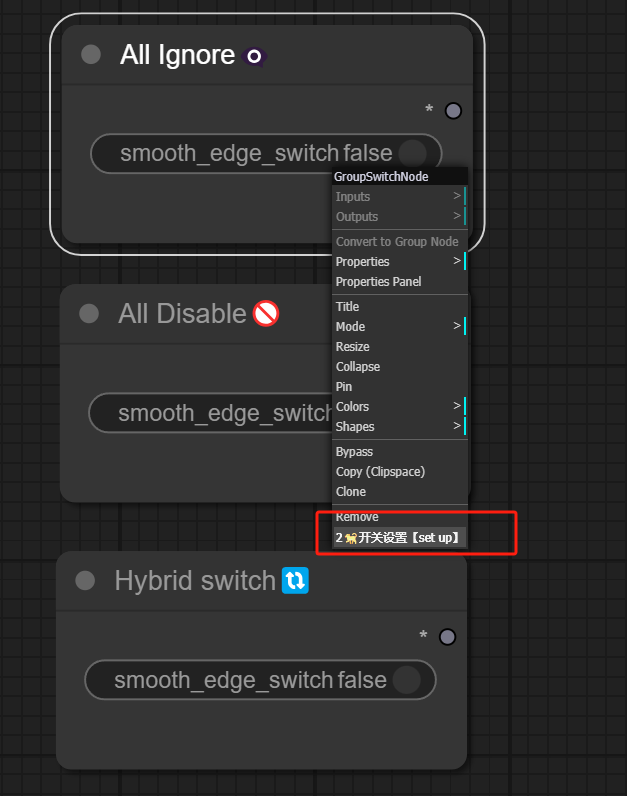

哈喽！我是二狗子（2🐕）！这是一套针对Comfyui流程设计师及玩家的混合组开关套件，一键实现控制不同组别的忽略禁用   
Hello! I am Er Gouzi （2🐕）！ This is a mixed group switch kit designed for Comfyui process designers and players, which allows for one click control of ignoring and disabling different groups

## 安装
Installation

首先，打开命令行终端，然后切换到您的ComfyUI的`custom_nodes`目录：   
Firstly, open the command line terminal and then switch to the 'custom_dodes' directory in your ComfyUI:   

```cd /path/to/your/ComfyUI/custom_nodes```

将/path/to/your/ComfyUI替换为您的ComfyUI项目所在的实际路径。   
Replace/path/to/your/ComfyUI with the actual path where your ComfyUI project is located.   
接下来，克隆ergouzi-kaiguan仓库：   
Next, clone the ergouzi kaiguan repository:   

```git clone https://github.com/11dogzi/Comfyui-ergouzi-kaiguan.git```

## 节点介绍   
## 全局开关节点："Universal switch▶️"    
通过节点右键菜单选项卡进行开关设置，对全局的节点组进行开关方案的勾选，多个"Universal switch▶️"节点建立时，将会每次仅打开的节点生效，防止开关冲突！
    
    

## 连线开关节点："All Ignore👁️‍🗨️▶️"    
当该节点连接"ALL🚫👁️‍🗨️"时，则对当前节点连接的"ALL🚫👁️‍🗨️"所在组进行忽略处理，可连接多个"ALL🚫👁️‍🗨️"控制多组    
       

## 连线开关节点："All Disable🚫"    
当该节点连接"ALL🚫👁️‍🗨️"时，则对当前节点连接的"ALL🚫👁️‍🗨️"所在组进行禁用处理，可连接多个"ALL🚫👁️‍🗨️"控制多组    
    

## 连线混合开关节点："Hybrid switch🔃"    
当该节点连接"hulue🔃"时，则对当前节点连接的"hulue🔃"所在组进行忽略处理，当该节点连接"jin yong🔃"时，则对当前节点连接的"jin yong🔃"所在组进行禁用处理，可连接多个"jin yong🔃"或者"hulue🔃"进行混合控制    
     

## 开关点示例：    
   

## 开关名称设置：    
    
    

## 功能节点："Recursive switching🔀"    
输入N个输入，对第一个非空值进行输出，可以设置需要切换的输入数量以及记录每个输入点名称    
    
    
    


